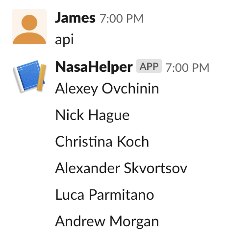

# API's

To use an API is basicaly two lines. We will give you several examples with different Python libraries to show you rich variety.

Example with library ```urllib```
```python
from urllib.request import urlopen
data = urlopen("http://api.open-notify.org/astros.json").read().decode()
```

API response is in ```data``` variable.

Probably this data is in JSON format

```python
from urllib.request import urlopen
import json
data = urlopen("http://api.open-notify.org/astros.json").read().decode()

data = json.loads(data)
print(data)
``` 

Now you can access ```data``` as a dictionary, like ```data["message"]```.  

May be you what to check the errors

```python
from urllib.request import urlopen
from urllib.error import HTTPError
import json

try:
    data = urlopen("http://api.open-notify.org/wrong_api_url").read().decode()
    data = json.loads(data)
    print(data)
except HTTPError as e:
    print(str(e))
```

Let's see how our example script looks in Slack, *[skills/api.py](../../skills/api.py)*



Another example with library ```requests```

```python
import requests
res = requests.get("http://api.open-notify.org/astros.json")
if (res.status_code == 200):
    data = res.json()
    print(data)
else:
    print("status code : "+ str(res.status_code))
```


