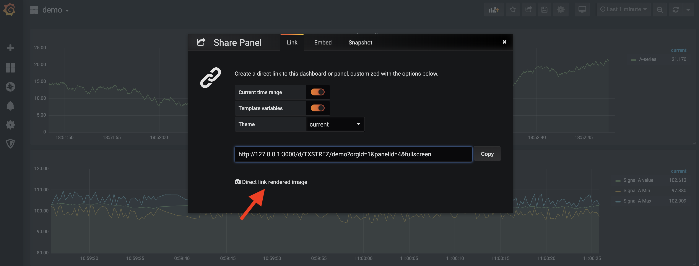

# Grafana

We will take advantage of the Grafana server side rendering feature that can render any panel on the server. To verify that this feature works try the ```Direct link rendered image``` link in the panel share dialog. If you do not get an image when opening this link read [here](https://grafana.com/docs/administration/image_rendering/) how to coonfigurate this feature.


