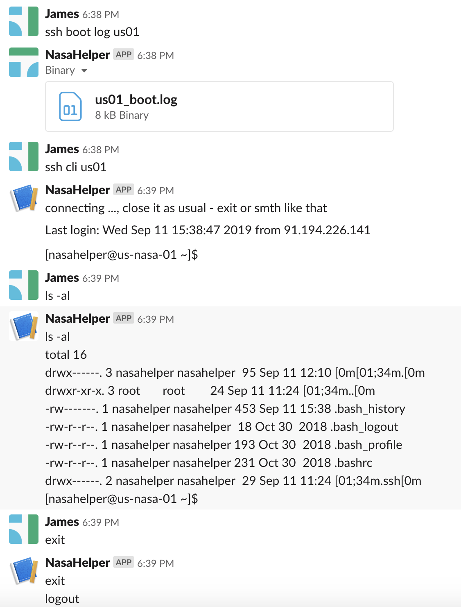

# SSH

The range of practical tasks that can be done through ssh connection is boundless. You can combine this infinity with the Chat Apps convenience. 

In our example *[skills/ssh.py](../../skills/ssh.py)* we do two things:
 - connect to the server by the request from Chat App, run command on that server and send output back to Chat App
 - server command line interface in Chat App 

To run this script you need to create ssh key pair - ```ssh-keygen -t rsa```, then copy public key to the server and private key to the Skillpub working folder (for more details better you serach in internet).

Pay attention to these - USERNAME, SSHKEY, NAME2IP_LIST. You need to specify these values to point to your server.

In the example we use well known Python module ```paramiko``` and our handmade module - *[modules/sshlib.py](../../modules/sshlib.py)*.

Folder structure should be like this:

```
|-- modules
    |-- sshlib.py
|-- skills
    |-- ssh.py
|-- .ssh
    |-- nasahelper-ssh-key
```

If everything went right you got smth like this



